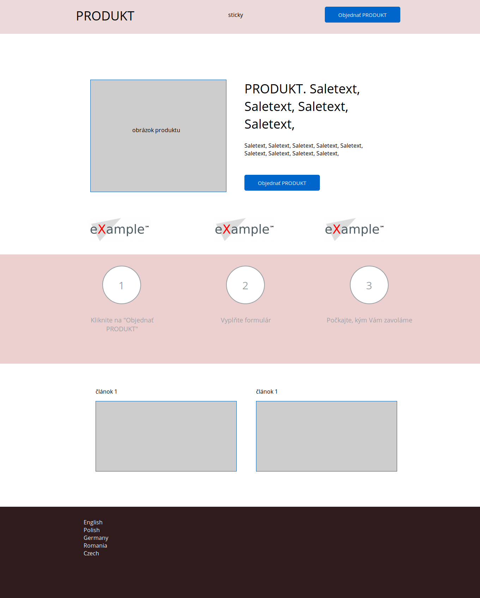

# Téma vzhledu Single Product pro WordPress

_For English version see [README.md][1]._

Jednoduché ale plně kofigurovatelné téma vzhledu pro [WordPress][4], které je určeno pro malé _e-commerce_ weby nabízející jeden produkt. Je založeno na skvělé knihovně [Bootstrap 4][5].

## Dárcovství

Pokud se vám tento plugin líbí a chcete podpořit jeho vývoj, můžete zvážit, zda vývojáři neposlat dar pomocí služby

[][3]

## Hlavní vlastnosti

- nový typ příspěvků __Produkt__
- všechny části tématu jsou editovatelné přes [vizuální návrhář][6]

## Obrázky

### Layout

[1]: README.md
[2]: https://wordpress.org/
[3]: https://www.paypal.me/ondrejd
[4]: https://wordpress.org/
[5]: https://getbootstrap.com/
[6]: https://developer.wordpress.org/themes/customize-api/